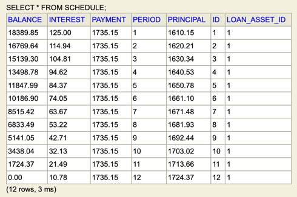
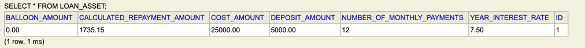

# Amortisation Scheduler (Technical Challenge)
[Submission by Ana Landicho, Feb 2024]

## DESCRIPTION
REST API implementation for creating an amortisation schedule for an asset being financed with the following requirements:
1. Create the amortisation schedule for a provided set of loan details (both with and without a balloon payment)
2. List previously created schedules, returning:
   - The details that were used to generate the schedule
   - The monthly repayment amount that was calculated
   - The total interest due
   - The total payments due
3. Retrieve the full details of an individual schedule, returning:
   - The contents of the list API for the schedule
   - The amortisation schedule that was prepared

An embedded database (H2) is used for the purpose of this project.

### API

| Resource | Input                                                                                       | Output                                                                                                                                                                                                                              | Desc                                                               |
|----------|---------------------------------------------------------------------------------------------|-------------------------------------------------------------------------------------------------------------------------------------------------------------------------------------------------------------------------------------|--------------------------------------------------------------------|
| `PUT /schedules/create`  | `costAmount`, `depositAmount`, `yearInterestRAte`,`numberOfMonthlyPayments`,`balloonAmount` | Creation confirmation obj                                                                                                                                                                                                           | Create an amortisation schedule given loan details                 |
| `GET /schedules/view/all` | n/a                                                                                         | List of PreviousSchedulesDto with following fields: `loanAssetId`, `costAmount`, `depositAmount` `yearInterestRate`, `numberOfMonthlyPayments`, `balloonAmount`, `calculatedRepaymentAmount`, `totalInterestDue`, `totalPaymentDue` | List all previously created schedules from database                |
| `GET /schedules/view/{assetId}` | `assetId` as query string param                                                             | RetrieveIndividualScheduleDto object containing fields:    ` details` `amortisationSchedule`                                                                                                                                        | Retrieve an individual asset details with its associated schedules |


## RUNNING THE APP
- Run in an IDE from main file:
`src/main/java/com/analandicho/AmortisationScheduler/AmortisationSchedulerApplication.java`

- Run on terminal using maven (from root project directory)
```shell
./mvnw spring-boot:run
```

## DATABASE
Access the database from `/h2-console` with credentials"
- JDBC URL: jdbc:h2:mem:testdb
- User Name: sa
- Password: password

## TESTS
Tests can be found in: `src/test`

## EXAMPLES (from Postman)
1. Create a Schedule 
    - REQUEST: `PUT http://localhost:8080/schedules/create` with request body:
   ```shell 
   {
    "costAmount" : 25000,
    "depositAmount" : 5000,
    "yearInterestRate" : 7.5,
    "numberOfMonthlyPayments": 12,
    "balloonAmount": 0
   }
   ```

    - RESPONSE
   ```shell
      {
    "assetId": 1,
    "statusMessage": "Schedule creation is successful"
   }
   ```
   
    - DB SNAPSHOT



2. List all created sched:
   - REQUEST: `GET http://localhost:8080/schedules/view/all`
   - RESPONSE
   ```shell
   [
    {
        "loanAssetId": 1,
        "costAmount": 25000.00,
        "depositAmount": 5000.00,
        "yearInterestRate": 7.50,
        "numberOfMonthlyPayments": 12,
        "balloonAmount": 0.00,
        "calculatedRepaymentAmount": 1735.15,
        "totalInterestDue": 821.79,
        "totalPaymentDue": 20821.80
    }
   ]```
   
3. Retrieve Individual Schedule
   - REQUEST: `GET http://localhost:8080/schedules/view/{{assetId}}` with `assetId=1`
   - RESPONSE
   ```shell
   [
    {
        "loanAssetId": 1,
        "costAmount": 25000.00,
        "depositAmount": 5000.00,
        "yearInterestRate": 7.50,
        "numberOfMonthlyPayments": 12,
        "balloonAmount": 0.00,
        "calculatedRepaymentAmount": 1735.15,
        "totalInterestDue": 821.79,
        "totalPaymentDue": 20821.80
    }
   ]```


## Miscellaneous

### Project Details

Project initialised with https://start.spring.io/ using following configurations:
- Project: Maven
- Language: Java 17 
- Spring Boot version: 3.2.2 
- Dependencies:
  - Spring Web 
  - Spring JPA 
  - H2 DB


### Development Platforms
- IDE: IntelliJ IDEA 2023.2 (Community Edition) Runtime version: 17.0.7+7-b1000.6 aarch64 VM: OpenJDK 64-Bit Server VM by JetBrains s.r.o.
- OS: macOS 14.2.1

  